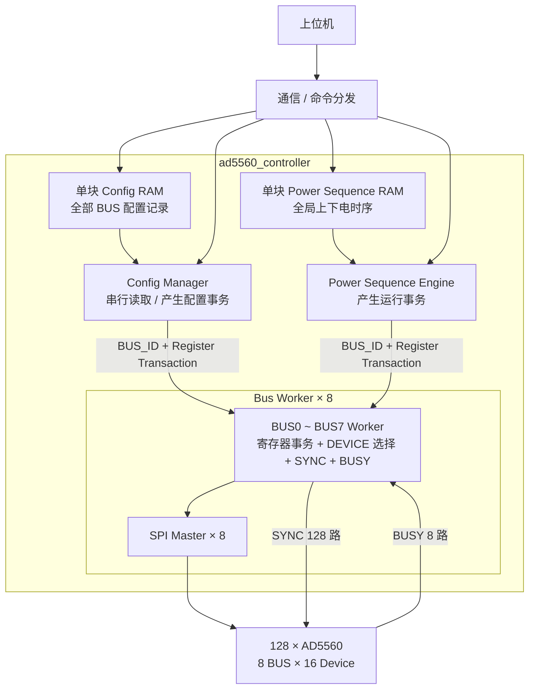

# AD5560 FPGA 系统架构

## 1. 系统

本系统由一片 FPGA 控制 **128 颗 AD5560**。上位机负责下发配置表和运行任务，FPGA 负责配置数据缓存、寄存器配置执行以及后续上下电时序控制。

### 1.1 SPI 与 SYNC

- 共 **8 组 SPI 总线**；
- 每组 SPI 连接 16 颗 AD5560；
- `SYNC` 每颗 AD5560 独立，共 **128 根 SYNC**；
- 每条 BUS 对应一组共享 `BUSY`；
- 每个 `Bus Worker` 负责本组 SPI、16 路 `SYNC` 和 1 路共享 `BUSY`。

### 1.2 HW_INH

系统当前只使用 **1 根全局 `HW_INH`**。

正常上下电主要采用 AD5560 的 **Ramp Function + SPI 软件控制**，`HW_INH` 不作为正常单通道上下电时序控制信号。

---

## 2. 配置数据组织

配置采用**寄存器级配置表**方式。

上位机直接生成并下发 AD5560 配置记录，每条记录包含：

```text
DEVICE_ID + REG_ADDR + REG_DATA
```

FPGA 不负责把电压、限流、Ramp 等工程参数转换成 AD5560 寄存器值，只负责保存和可靠执行配置表。

固定配置和通道可变配置使用同一种数据格式。固定寄存器可由上位机保存为默认 Config Table 并下发；后续如需固化到 FPGA，也可增加内部 `Config Loader`，向同一 `Config RAM` 写入配置记录，后级执行模块无需改变。

### 2.1 Config RAM 组织

当前确定采用 **单块全局 `Config RAM`**，不按 8 条 SPI BUS 分成 8 块 RAM。

所有 BUS、所有器件的配置记录按上位机生成的顺序连续存储。`Config Manager` 从头到尾顺序读取配置记录，根据其中的 `BUS_ID` 将当前事务发送给对应的 `Bus Worker`，等待该事务完成后继续读取下一条记录。

当前配置时间不是系统瓶颈，因此第一版配置阶段采用串行执行，优先保证通信、RAM 管理和 `Config Manager` 逻辑简单。

### 2.2 BUSY 处理

每条 SPI BUS 的 16 颗 AD5560 共用一根 `BUSY`，因此 `BUSY` 作为该 BUS 的组级资源，由对应 `Bus Worker` 直接管理。

第一版采用保守策略：**每完成一笔 SPI transaction，都等待 AD5560 内部处理完成后再返回事务结束**，不使用 BUSY 期间的流水发送优化。

### 2.3 SYNC 处理

`SYNC` 由各 `Bus Worker` 直接管理。

每个 `Bus Worker` 负责本组 16 颗 AD5560 的 16 路独立 `SYNC`。每次 SPI transaction 根据 `DEVICE_ID` 只选择一颗器件。

---

## 3. 上下电时序组织

上下电时序采用 **单块全局 `Power Sequence RAM` + 单个 `Power Sequence Engine`**。

128 路上下电时序属于同一个全局时间轴，不按 BUS 分成 8 套独立时序。

与配置阶段不同，上下电时序需要考虑多通道并行启动：

- 不同 BUS 之间具备独立 `Bus Worker / SPI Master`，可以并行执行；
- 同一 BUS 内仍保持一次只选择一颗 AD5560；
- `Power Sequence Engine` 不要求等待当前事务 `done` 后才读取下一条，而是在目标 `Bus Worker` 完成 `valid / ready` 握手后即可继续读取下一条；
- 如果下一条命令属于其他空闲 BUS，可立即握手，使多个 BUS 的事务自然重叠执行；
- 如果下一条仍属于当前忙碌 BUS，则等待该 BUS 再次 `ready`。

因此当前确定：**配置阶段串行执行；运行阶段通过各 Bus Worker 独立握手，允许多条 BUS 同时处于工作状态。**

---

## 6. 各模块连接关系



顶层循环例化 8 个 `Bus Worker`，每个实例具有固定 `BUS_ID`，根据上层输出的 `bus_sel / BUS_ID` 直接生成本实例的选择信号，例如：

```verilog
assign bus_selected = (bus_sel == BUS_ID);
```

目标 BUS 的 `ready` 再按 `bus_sel` 选择回送给当前请求源。该方式与现有多相 Buck 工程中的多 BUS 选择方式一致，不需要额外增加独立 MUX 模块。
