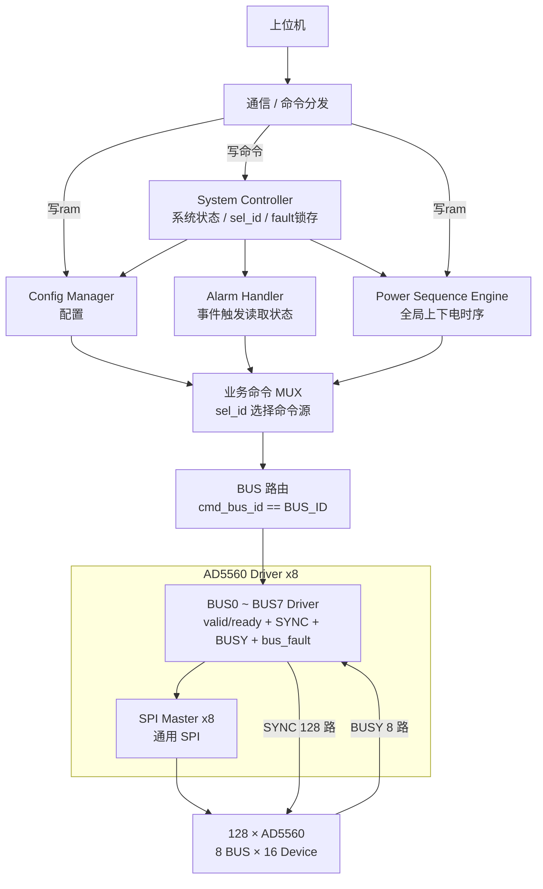

# AD5560 FPGA 系统架构

## 1. 系统

本系统由一片 FPGA 控制 **128 颗 AD5560**。上位机负责下发配置表和运行命令，FPGA 负责配置执行、上下电时序、Alarm 处理、系统 fault 处理以及 AD5560 寄存器访问。

### 1.1 SPI 与控制信号

- 共 **8 组 SPI 总线**；
- 每组 SPI 连接 16 颗 AD5560；
- `SYNC` 每颗 AD5560 独立，共 **128 路**；
- 每条 BUS 对应 1 路共享 `BUSY`；
- 每条 BUS 对应 1 路 `ALARM`；
- 每条 BUS 对应一个 `AD5560 Driver` 和一个通用 `SPI Master`。

`AD5560 Driver` 负责本 BUS 的寄存器事务、16 路 `SYNC` 选择、`BUSY` timeout 和本 BUS sticky `bus_fault`。

### 1.2 HW_INH

系统当前只使用 **1 根全局 `HW_INH`**。

正常上下电主要采用 AD5560 的 **Ramp Function + SPI 软件控制**，`HW_INH` 不作为正常单通道上下电时序控制信号。


---


## 2. Driver BUS 选择

System Controller 只根据系统状态产生 `sel_id`，用于选择当前业务模块。

当前业务模块输出统一命令字段：

```text
cmd_valid
cmd_bus_id
cmd_device_id
cmd_reg_addr
cmd_wr_data
```

顶层对 8 个 Driver 循环例化，并在每个实例中用固定 `BUS_ID` 与 `cmd_bus_id` 比较：

```verilog
assign bus_selected = (cmd_bus_id == BUS_ID);
assign driver_cmd_valid = cmd_valid && bus_selected;
assign cmd_ready = driver_cmd_ready[cmd_bus_id];
```

因此 8 条 BUS 的目标选择由命令自身的 `BUS_ID` 和顶层 generate 路由完成，不由 System Controller 做 BUS 仲裁。

Driver 在 `valid && ready` 时锁存本次命令，因此握手后当前业务模块可以继续处理下一条事务。

### 2.1 业务模块握手原则

Config Manager、Power Sequence Engine、Alarm Handler 等业务模块只以 `valid / ready` 作为命令提交握手。

```text
valid && ready = 1
```

表示当前命令已经被目标 Driver 接收。业务模块在握手完成后即可继续后续流程，不需要：

- 等待额外的 `ok / done`；
- 判断 SPI / BUSY 执行是否成功；
- 自行处理底层 Driver 错误。

底层事务由 Driver 独立执行；Driver 检测到 `BUSY timeout` 等异常后输出 `bus_fault`，系统级错误由 System Controller 统一锁存和处理，并根据需要向当前业务模块发出 `abort / pause`。

因此业务模块只负责“产生命令并完成握手”，不重复实现底层错误判断和完成确认。

---

## 3. 各模块连接关系


