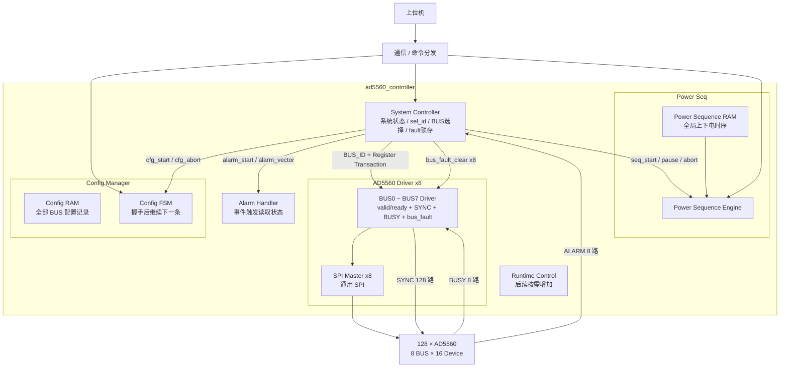

# AD5560 FPGA 系统架构

## 1. 系统

本系统由一片 FPGA 控制 **128 颗 AD5560**。上位机负责下发配置表和运行命令，FPGA 负责配置执行、上下电时序、Alarm 处理、系统 fault 处理以及 AD5560 寄存器访问。

### 1.1 SPI 与控制信号

- 共 **8 组 SPI 总线**；
- 每组 SPI 连接 16 颗 AD5560；
- `SYNC` 每颗 AD5560 独立，共 **128 路**；
- 每条 BUS 对应 1 路共享 `BUSY`；
- 每条 BUS 对应 1 路 `ALARM`；
- 每条 BUS 对应一个 `AD5560 Driver` 和一个通用 `SPI Master`。

`AD5560 Driver` 负责本 BUS 的寄存器事务、16 路 `SYNC` 选择、`BUSY` timeout 和本 BUS sticky `bus_fault`。

### 1.2 HW_INH

系统当前只使用 **1 根全局 `HW_INH`**。

正常上下电主要采用 AD5560 的 **Ramp Function + SPI 软件控制**，`HW_INH` 不作为正常单通道上下电时序控制信号。

---

## 2. System Controller

`System Controller` 是 AD5560 子系统的顶层控制状态机。

它负责：

- 接收上位机配置、上下电等运行命令；
- 控制 `Config Manager`、`Power Sequence Engine` 和 `Alarm Handler` 启停；
- 根据当前系统状态产生 `sel_id`，选择当前寄存器命令源；
- 根据 `BUS_ID` 将当前命令送到目标 Driver；
- 返回目标 Driver 的 `ready` 和读回数据；
- 接收并锁存 `ALARM[7:0]`；
- 接收 8 路 Driver `bus_fault`，锁存系统 fault 信息；
- fault 锁存完成后清除 Driver 内部 sticky fault；
- fault 时终止当前 Config / Sequence 并进入 `FAULT` 状态。

---

## 3. Config Manager

配置采用寄存器级配置表：

```text
BUS_ID + DEVICE_ID + REG_ADDR + REG_DATA
```

单块全局 `Config RAM` 放在 `Config Manager` 内部，不按 8 条 BUS 分开。

通信侧先写入配置表，随后上位机下发配置启动命令，由 `System Controller` 产生 `cfg_start`。

```text
System Controller
      │ cfg_start / cfg_abort
      ▼
Config Manager
```

Config Manager 顺序读取记录。当前记录完成 `valid / ready` 握手后立即继续下一条，不等待 SPI 事务真正完成。

不同 BUS 已接受的配置事务可以并行执行；如果后续记录目标 Driver 尚未 ready，则停在当前记录等待。

Config Manager 不直接判断系统 `bus_fault`。fault 由 System Controller 统一处理，并通过 `cfg_abort` 终止配置。

---

## 4. AD5560 Driver

系统实例化 8 个 `AD5560 Driver`，每个 Driver 对应一条物理 SPI BUS。

Driver 直接通过 `valid / ready` 接收 System Controller 转发的寄存器事务，并在握手时锁存命令参数。

每个 Driver 负责：

- 根据 `DEVICE_ID` 将 SPI Master 单路 `CS_n` 映射到本组 16 路独立 `SYNC` 中的一路；
- 组织 AD5560 寄存器读写 SPI 帧；
- 封装 readback 两帧流程；
- 调用通用 `SPI Master`；
- 对写事务检测共享 `BUSY` 并处理 timeout；
- `BUSY timeout` 时锁存本 BUS 的 `bus_fault`；
- 接收 System Controller 的 `bus_fault_clear` 清除本地 sticky fault。

因此：

```text
不同 BUS：8 个 Driver 可并行执行
同一 BUS：单个 Driver 一次只接受一笔事务，自动串行
```

---

## 5. 上下电时序

上下电时序采用 **单块全局 `Power Sequence RAM` + 单个 `Power Sequence Engine`**。

128 路上下电时序属于同一个全局时间轴，不按 BUS 分成 8 套独立时序。

System Controller 根据上位机命令控制：

```text
seq_start
seq_pause
seq_abort
```

Power Sequence Engine 顺序读取时序记录并产生：

```text
BUS_ID + Register Transaction
```

当前记录完成 `valid / ready` 握手后即可继续下一条，不等待目标 Driver 的 SPI 事务完成。

Alarm 处理期间 System Controller 暂停新的 Sequence 命令派发；发生系统 `bus_fault` 时直接 `seq_abort`。

---

## 6. ALARM 与运行期状态读取

AD5560 不做后台寄存器轮询，也不设置 Telemetry RAM。

电压、电流实时值由系统外部 ADC 采样，不通过 AD5560 寄存器周期读取。外部 ADC 的具体采样链路不在本文档中展开。

每条 BUS 提供 1 路 `ALARM`，共 8 路。ALARM 先进入 System Controller：

```text
ALARM[7:0]
    ↓
System Controller
    ↓ 锁存 alarm_vector / alarm_start
Alarm Handler
    ↓ register read command
System Controller
    ↓
目标 AD5560 Driver
```

System Controller 收到 ALARM 后切换：

```text
sel_id = SEL_ALARM
```

Alarm Handler 按需要读取对应 BUS 上 AD5560 的 Alarm / Fault Status 寄存器进行故障定位。

已经被 Driver 接受的 SPI 事务不取消。Alarm Handler 完成后，如果没有系统 fault，再返回被 Alarm 打断前的正常状态。

---

## 7. bus_fault 处理

每个 Driver 输出一位 sticky `bus_fault`，8 路汇总到 System Controller：

```text
driver_bus_fault[7:0]
```

System Controller 检测到 fault 后：

```text
1. fault_vector_latched[7:0] <- driver_bus_fault[7:0]
2. cfg_abort / seq_abort
3. 进入 FAULT 状态
4. 锁存完成后向对应 Driver 发 bus_fault_clear 脉冲
```

系统内部保留完整：

```text
fault_vector_latched[7:0]
```

需要单个 `fault_id` 时可由该向量编码得到。

清除 Driver 内部 `bus_fault` 只用于释放底层 sticky 状态，不代表系统恢复。System Controller 的故障锁存继续保持，直到上位机明确执行故障复位 / 重新启动。

第一版事件优先级：

```text
bus_fault > ALARM > 当前正常工作状态
```

---

## 8. Driver BUS 选择

System Controller 先根据 `sel_id` 选择当前命令源，再根据当前命令的 `BUS_ID` 选择目标 Driver：

```verilog
assign driver_cmd_valid[n] = cmd_valid && (cmd_bus_id == n);
assign cmd_ready = driver_cmd_ready[cmd_bus_id];
```

Driver 在 `valid && ready` 时锁存本次命令，因此握手后当前命令源可以继续处理下一条事务。

---

## 9. 各模块连接关系


