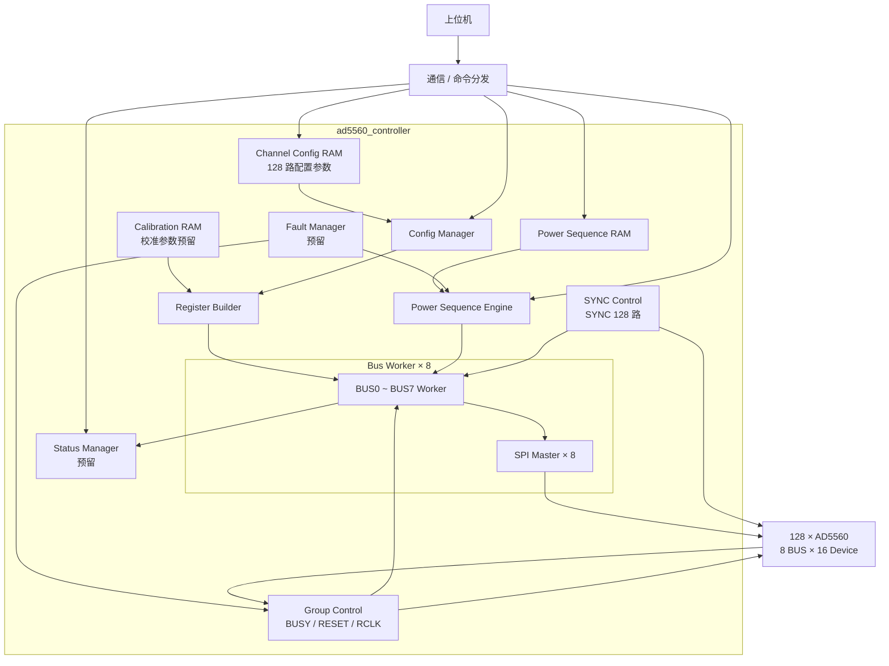

# AD5560 FPGA 系统架构

## 1. 系统定位

本系统由一片 FPGA 控制 **128 颗 AD5560**。上位机负责下发各通道配置参数和运行任务，FPGA 负责参数缓存、AD5560 配置执行以及后续上下电时序控制。

---

## 2. 数字控制信号划分

### 3.1 SPI 与 SYNC

- 共 **8 组 SPI 总线**；
- 每组 SPI 连接 16 颗 AD5560；
- `SYNC` 每颗 AD5560 独立，共 **128 根 SYNC**；
- 每条 BUS 对应一组 `BUSY`。
- FPGA 通过 BUS 和 SYNC 的组合选择具体 AD5560。

### 3.3 HW_INH

系统当前只使用 **1 根全局 `HW_INH`**。

正常上下电主要采用 AD5560 的 **Ramp Function + SPI 软件控制**，`HW_INH` 不作为正常单通道上下电时序控制信号。

---

## 4. FPGA 模块初步划分

当前先按以下模块划分组织 FPGA 内部功能，后续再逐个讨论模块接口和 RTL 细节。

```text
ad5560_controller
│
├── channel_config_ram
│     └─ 保存 128 路通道配置参数
│
├── calibration_ram
│     └─ 预留保存通道校准参数，具体组织后续确定
│
├── config_manager
│     └─ 读取通道配置并组织 AD5560 配置任务
│
├── register_builder
│     └─ 将通道参数及固定配置转换为 AD5560 寄存器写操作
│
├── bus_worker[0..7]
│     └─ 每个实例负责一组 16 颗 AD5560 的事务调度
│          └── spi_master
│                └─ 产生对应 SPI BUS 的底层时序
│
├── power_sequence_ram
│     └─ 保存上下电时序任务
│
├── power_sequence_engine
│     └─ 按时序启动 / 停止各通道 Ramp
│
├── group_control
│     └─ 管理组级 BUSY / RESET / RCLK
│
├── sync_control
│     └─ 管理 128 路独立 SYNC
│
├── fault_manager
│     └─ 故障处理功能预留，具体策略后续讨论
│
└── status_manager
      └─ 状态汇总与上位机查询功能预留
```

`Config Manager` 和 `Power Sequence Engine` 均需要通过下层 BUS 执行模块访问 AD5560，但两者分别负责“配置阶段”和“运行时序阶段”，功能上保持分离。

---

## 5. 各模块连接关系



当前图只表达功能连接关系：

- 上位机配置数据先进入 `Channel Config RAM`；
- `CONFIG_START` 触发 `Config Manager` 开始配置流程；
- `Register Builder` 根据通道参数和固定配置形成具体 AD5560 寄存器操作；
- 8 个 `Bus Worker` 分别服务 BUS0～BUS7，每个 BUS 内管理 16 颗 AD5560；
- 每个 `Bus Worker` 下层使用一个 `SPI Master` 驱动物理 SPI 总线；
- `SYNC Control` 根据 BUS / DEVICE 选择产生 128 路独立 SYNC；
- `Group Control` 统一处理每组共享的 `BUSY / RESET / RCLK`；
- `Power Sequence Engine` 与配置流程分开，负责配置完成后的上下电时序和 Ramp 启停；
- `Fault Manager`、`Status Manager` 目前仅保留系统级位置，详细职责暂不展开。

---
