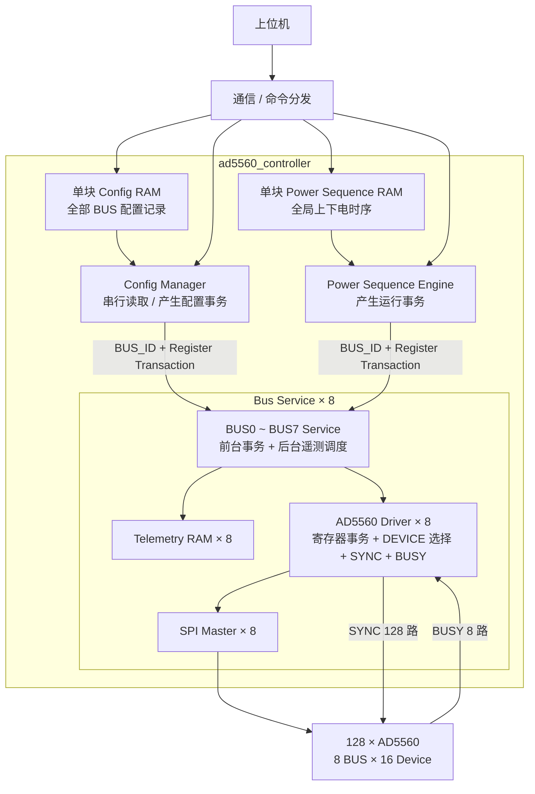

# AD5560 FPGA 系统架构

## 1. 系统

本系统由一片 FPGA 控制 **128 颗 AD5560**。上位机负责下发配置表和运行任务，FPGA 负责配置数据缓存、寄存器配置执行、上下电时序控制以及后台遥测。

### 1.1 SPI 与 SYNC

- 共 **8 组 SPI 总线**；
- 每组 SPI 连接 16 颗 AD5560；
- `SYNC` 每颗 AD5560 独立，共 **128 根 SYNC**；
- 每条 BUS 对应一组共享 `BUSY`；
- 每条 BUS 对应一个 `Bus Service` 和一个 `AD5560 Driver`；
- `AD5560 Driver` 负责本组 SPI、16 路 `SYNC` 和 1 路共享 `BUSY`。

### 1.2 HW_INH

系统当前只使用 **1 根全局 `HW_INH`**。

正常上下电主要采用 AD5560 的 **Ramp Function + SPI 软件控制**，`HW_INH` 不作为正常单通道上下电时序控制信号。

---

## 2. 配置数据组织

配置采用**寄存器级配置表**方式。

上位机直接生成并下发 AD5560 配置记录，每条记录包含：

```text
BUS_ID + DEVICE_ID + REG_ADDR + REG_DATA
```

FPGA 不负责把电压、限流、Ramp 等工程参数转换成 AD5560 寄存器值，只负责保存和可靠执行配置表。

固定配置和通道可变配置使用同一种数据格式。固定寄存器可由上位机保存为默认 Config Table 并下发；后续如需固化到 FPGA，也可增加内部 `Config Loader`，向同一 `Config RAM` 写入配置记录，后级执行模块无需改变。

### 2.1 Config RAM 组织

当前确定采用 **单块全局 `Config RAM`**，不按 8 条 SPI BUS 分成 8 块 RAM。

所有 BUS、所有器件的配置记录按上位机生成的顺序连续存储。`Config Manager` 从头到尾顺序读取配置记录，根据其中的 `BUS_ID` 将当前事务发送给对应的 `Bus Service`。

当前配置时间不是系统瓶颈，因此第一版配置阶段采用串行执行，优先保证通信、RAM 管理和 `Config Manager` 逻辑简单。

---

## 3. Bus Service

每条 SPI BUS 设置一个 `Bus Service`，负责该 BUS 的本地任务调度。

主要职责：

- 接收 `Config Manager`、`Power Sequence Engine` 等上层产生的前台寄存器事务；
- 在总线空闲时执行本 BUS 的后台遥测轮询；
- 前台事务优先于后台遥测；
- 调用本 BUS 的 `AD5560 Driver` 完成实际寄存器读写；
- 保存本 BUS 的最新遥测结果。

遥测功能按 BUS 独立运行，因此采用 **每 BUS 一块 Telemetry RAM**。各 BUS 可以同时进行遥测，不需要对遥测 RAM 的写入做跨 BUS 仲裁。

当前遥测内容可包括 AD5560 电压、电流、故障状态等，具体轮询寄存器和数据格式后续再确定。

`Bus Service` 不保存 Config RAM。配置表仍由全局 `Config Manager` 顺序读取并按 `BUS_ID` 分发。

---

## 4. AD5560 Driver

`AD5560 Driver` 是单条 BUS 的 AD5560 寄存器事务执行层，只负责完成一笔指定器件的寄存器读写，不负责配置表管理、上下电时序调度或遥测轮询。

每个 Driver 负责：

- 根据 `DEVICE_ID` 控制本组 16 路独立 `SYNC`，一次事务只选择一颗器件；
- 组织 AD5560 寄存器读写所需 SPI 帧；
- 封装 AD5560 读寄存器所需的多帧操作；
- 调用通用 `SPI Master`；
- 检测本组共享 `BUSY` 并处理 timeout。

---

## 5. 上下电时序组织

上下电时序采用 **单块全局 `Power Sequence RAM` + 单个 `Power Sequence Engine`**。

128 路上下电时序属于同一个全局时间轴，不按 BUS 分成 8 套独立时序。

`Power Sequence Engine` 顺序读取时序记录，并通过 `BUS_ID` 将当前寄存器事务送到对应的 `Bus Service`。当前目标 BUS 完成 `valid / ready` 握手后即可读取下一条记录，不需要等待该 BUS 的实际寄存器事务完成。

因此：

```text
不同 BUS：事务可以重叠执行
同一 BUS：由本 BUS Service / Driver 自动串行执行
```

不同 BUS 的启动时间可能相差少量 FPGA clk，但不要求严格同一时钟周期启动。

---

## 6. 多 BUS 选择

8 个 `Bus Service` 在顶层通过 `generate` 循环例化，每个实例具有固定 `BUS_ID`。

上层输出单路事务和 `bus_sel`，顶层直接选择目标 BUS：

```verilog
localparam [2:0] BUS_ID = bus_index;
wire bus_selected;

assign bus_selected = (bus_sel == BUS_ID);
assign service_cmd_valid[bus_index] = cmd_valid && bus_selected;

assign selected_ready = service_ready[bus_sel];
```

不设置独立的 Bus Command MUX 模块。

---

## 7. 各模块连接关系


