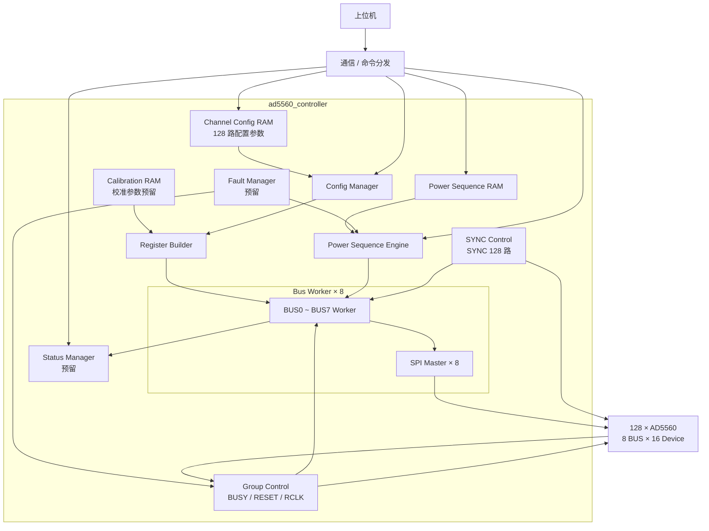

# AD5560 FPGA 系统架构

## 1. 系统定位

本系统由一片 FPGA 控制 **128 颗 AD5560**。上位机负责下发各通道配置参数和运行任务，FPGA 负责参数缓存、AD5560 配置执行以及后续上下电时序控制。

当前系统级功能划分为：

```text
上位机
  │ 下发通道配置 / 启动配置 / 下发上下电时序
  ▼
FPGA
  ├─ 配置参数缓存
  ├─ AD5560 配置管理
  ├─ 8 路 SPI 总线控制
  └─ 上下电时序控制
        │
        ▼
     128 × AD5560
```

目前仅确定系统级功能划分和硬件连接关系。本文中的模块名称和边界作为后续 RTL 讨论的初版骨架，具体配置 RAM 字段、寄存器配置顺序、校准数据组织、状态反馈及故障处理细节后续再确定。

---

## 2. AD5560 与 SPI 总线划分

系统共有 **8 条独立 SPI 总线**，每条 SPI 总线连接 **16 颗 AD5560**：

```text
BUS0 -> CH0   ~ CH15
BUS1 -> CH16  ~ CH31
BUS2 -> CH32  ~ CH47
BUS3 -> CH48  ~ CH63
BUS4 -> CH64  ~ CH79
BUS5 -> CH80  ~ CH95
BUS6 -> CH96  ~ CH111
BUS7 -> CH112 ~ CH127
```

因此：

```text
8 BUS × 16 AD5560/BUS = 128 AD5560
```

全局通道号暂按以下关系映射：

```text
BUS_ID    = CHANNEL_ID / 16
DEVICE_ID = CHANNEL_ID % 16
```

每条 BUS 的 16 颗器件共享 SPI 数据与时钟信号，由独立 `SYNC` 信号选择具体器件。

---

## 3. 数字控制信号划分

### 3.1 SPI 与 SYNC

- 共 **8 组 SPI 总线**；
- 每组 SPI 连接 16 颗 AD5560；
- `SYNC` 每颗 AD5560 独立，共 **128 根 SYNC**；
- FPGA 通过 BUS 和 SYNC 的组合选择具体 AD5560。

### 3.2 组级信号

每 16 颗 AD5560 为一组，与一条 SPI BUS 对应。

以下信号按组共享，因此各有 **8 根**：

- `BUSY[7:0]`
- `RESET[7:0]`
- `RCLK[7:0]`

即每条 BUS 对应一组 `BUSY / RESET / RCLK`。

### 3.3 HW_INH

系统当前只使用 **1 根全局 `HW_INH`**。

正常上下电主要采用 AD5560 的 **Ramp Function + SPI 软件控制**，`HW_INH` 不作为正常单通道上下电时序控制信号。

---

## 4. FPGA 模块初步划分

当前先按以下模块划分组织 FPGA 内部功能，后续再逐个讨论模块接口和 RTL 细节。

```text
ad5560_controller
│
├── channel_config_ram
│     └─ 保存 128 路通道配置参数
│
├── calibration_ram
│     └─ 预留保存通道校准参数，具体组织后续确定
│
├── config_manager
│     └─ 读取通道配置并组织 AD5560 配置任务
│
├── register_builder
│     └─ 将通道参数及固定配置转换为 AD5560 寄存器写操作
│
├── bus_worker[0..7]
│     └─ 每个实例负责一组 16 颗 AD5560 的事务调度
│          └── spi_master
│                └─ 产生对应 SPI BUS 的底层时序
│
├── power_sequence_ram
│     └─ 保存上下电时序任务
│
├── power_sequence_engine
│     └─ 按时序启动 / 停止各通道 Ramp
│
├── group_control
│     └─ 管理组级 BUSY / RESET / RCLK
│
├── sync_control
│     └─ 管理 128 路独立 SYNC
│
├── fault_manager
│     └─ 故障处理功能预留，具体策略后续讨论
│
└── status_manager
      └─ 状态汇总与上位机查询功能预留
```

其中当前配置主链路重点为：

```text
Channel Config RAM
        ↓
   Config Manager
        ↓
  Register Builder
        ↓
  Bus Worker × 8
        ↓
   SPI Master × 8
        ↓
   128 × AD5560
```

上下电运行链路重点为：

```text
Power Sequence RAM
        ↓
Power Sequence Engine
        ↓
   Bus Worker × 8
        ↓
   SPI Master × 8
        ↓
 AD5560 Ramp Control
```

`Config Manager` 和 `Power Sequence Engine` 均需要通过下层 BUS 执行模块访问 AD5560，但两者分别负责“配置阶段”和“运行时序阶段”，功能上保持分离。

---

## 5. 各模块连接关系



当前图只表达功能连接关系：

- 上位机配置数据先进入 `Channel Config RAM`；
- `CONFIG_START` 触发 `Config Manager` 开始配置流程；
- `Register Builder` 根据通道参数和固定配置形成具体 AD5560 寄存器操作；
- 8 个 `Bus Worker` 分别服务 BUS0～BUS7，每个 BUS 内管理 16 颗 AD5560；
- 每个 `Bus Worker` 下层使用一个 `SPI Master` 驱动物理 SPI 总线；
- `SYNC Control` 根据 BUS / DEVICE 选择产生 128 路独立 SYNC；
- `Group Control` 统一处理每组共享的 `BUSY / RESET / RCLK`；
- `Power Sequence Engine` 与配置流程分开，负责配置完成后的上下电时序和 Ramp 启停；
- `Fault Manager`、`Status Manager` 目前仅保留系统级位置，详细职责暂不展开。

---

## 6. 配置功能框架

配置采用“**先缓存参数，再统一执行配置**”的方式。

基本流程：

```text
上位机下发 128 路配置参数
          │
          ▼
   Channel Config RAM
          │
上位机发送 CONFIG_START
          │
          ▼
     Config Manager
          │
          ▼
    Register Builder
          │
          ├─ BUS0 Worker
          ├─ BUS1 Worker
          ├─ ...
          └─ BUS7 Worker
                    │
                    ▼
               8 路 SPI
                    │
                    ▼
              128 × AD5560
```

配置参数按全局 `CHANNEL_ID` 组织。配置执行时，FPGA 根据通道号确定对应的 `BUS_ID` 和 `DEVICE_ID`，再通过对应 SPI BUS 和独立 SYNC 完成器件配置。

8 条 SPI 总线相互独立，后续配置控制器按 **8 路并行执行**设计；每条 BUS 内部依次处理本组的 16 颗 AD5560。

配置 RAM 当前只确定用于保存各通道需要的配置参数，具体 RAM 宽度、字段定义以及物理上采用单块 RAM 还是按 BUS 分块，暂不在本文确定。

---

## 7. 配置参数与固定配置的职责划分

上位机主要下发会随通道或测试任务变化的参数，例如：

- 目标电压；
- 电流限制相关参数；
- Ramp 斜率相关参数；
- 其他后续确定的通道级可变参数。

AD5560 中长期固定、与具体 DUT Recipe 无关的寄存器配置，不要求上位机每次重复下发，后续由 FPGA 固定配置模板统一管理。

当前阶段暂不进一步定义具体寄存器归属和 RAM 字段。

---

## 8. 上下电时序功能

AD5560 各通道完成基础配置后，上位机再下发上下电时序任务，由 FPGA 本地执行。

系统采用：

> **AD5560 Ramp Function 控制单通道电压斜率，FPGA 控制 128 路之间的启动和停止先后顺序。**

因此配置功能与上下电时序功能分开：

```text
配置参数下载
    ↓
AD5560 配置完成
    ↓
上下电时序下载 / 启动
    ↓
FPGA 按时序控制各通道 Ramp
```

具体上下电步骤和 Ramp 控制机理见 [`AD5560_PROJECT_POWER_SEQUENCE.md`](./AD5560_PROJECT_POWER_SEQUENCE.md) 和 [`AD5560_CONTROL.md`](./AD5560_CONTROL.md)。

---

## 9. 当前确定的系统边界

当前已确定：

- 1 片 FPGA 控制 128 颗 AD5560；
- 8 条 SPI BUS，每条 BUS 16 颗 AD5560；
- 128 根独立 `SYNC`；
- 每组共享一根 `BUSY`、`RESET`、`RCLK`，共各 8 根；
- 全系统 1 根 `HW_INH`；
- 正常上下电使用 Ramp Function，主要由软件/SPI 控制；
- 上位机先下发通道配置到 RAM，再启动 FPGA 配置任务；
- 8 条 SPI BUS 的配置任务可并行执行；
- 配置完成后，再由独立的上下电时序功能控制各通道运行。

尚未讨论或尚未最终确定的细节，不在本版系统架构中展开。