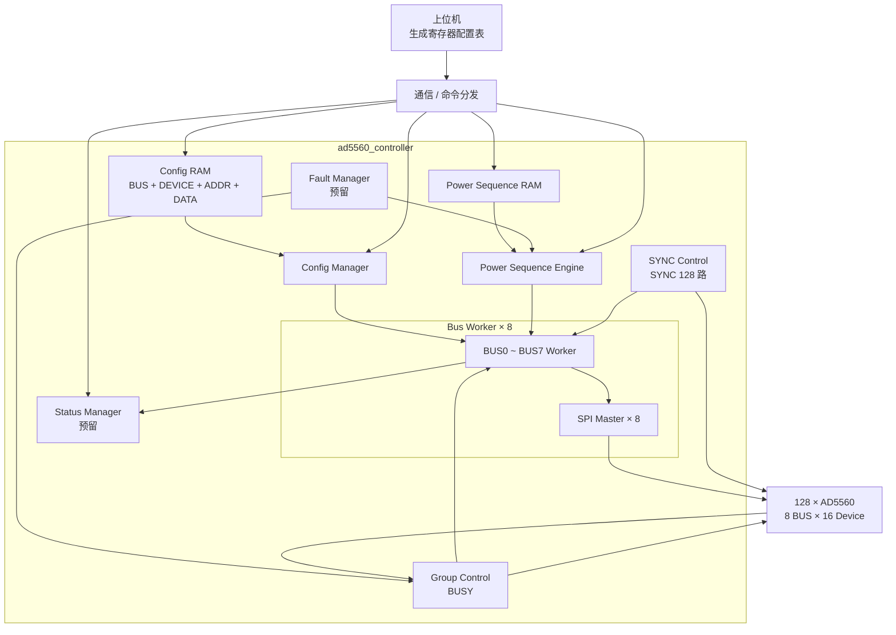

# AD5560 FPGA 系统架构

## 1. 系统定位

本系统由一片 FPGA 控制 **128 颗 AD5560**。上位机负责下发配置表和运行任务，FPGA 负责配置数据缓存、寄存器配置执行以及后续上下电时序控制。

---

## 2. 数字控制信号划分

### 2.1 SPI 与 SYNC

- 共 **8 组 SPI 总线**；
- 每组 SPI 连接 16 颗 AD5560；
- `SYNC` 每颗 AD5560 独立，共 **128 根 SYNC**；
- 每条 BUS 对应一组 `BUSY`；
- FPGA 通过 BUS 和 SYNC 的组合选择具体 AD5560。

### 2.2 HW_INH

系统当前只使用 **1 根全局 `HW_INH`**。

正常上下电主要采用 AD5560 的 **Ramp Function + SPI 软件控制**，`HW_INH` 不作为正常单通道上下电时序控制信号。

---

## 3. FPGA 模块初步划分

当前先按以下模块划分组织 FPGA 内部功能，后续再逐个讨论模块接口和 RTL 细节。

```text
ad5560_controller
│
├── config_ram
│     └─ 保存 AD5560 寄存器配置表
│
├── config_manager
│     └─ 读取配置表并组织配置任务
│
├── bus_worker[0..7]
│     └─ 每个实例负责一组 16 颗 AD5560 的事务调度
│          └── spi_master
│                └─ 产生对应 SPI BUS 的底层时序
│
├── power_sequence_ram
│     └─ 保存上下电时序任务
│
├── power_sequence_engine
│     └─ 按时序启动 / 停止各通道 Ramp
│
├── group_control
│     └─ 管理组级 BUSY
│
├── sync_control
│     └─ 管理 128 路独立 SYNC
│
├── fault_manager
│     └─ 故障处理功能预留，具体策略后续讨论
│
└── status_manager
      └─ 状态汇总与上位机查询功能预留
```

`Config Manager` 和 `Power Sequence Engine` 均需要通过下层 BUS 执行模块访问 AD5560，但两者分别负责“配置阶段”和“运行时序阶段”，功能上保持分离。

---

## 4. 配置数据组织

配置采用**寄存器级配置表**方式。

上位机直接生成并下发 AD5560 配置记录，每条记录包含：

```text
BUS_ID + DEVICE_ID + REG_ADDR + REG_DATA
```

FPGA 不负责把电压、限流、Ramp 等工程参数转换成 AD5560 寄存器值，只负责保存和可靠执行配置表。

采用寄存器级配置表后，固定配置和通道可变配置使用同一种数据格式。固定寄存器可先由上位机保存为默认 Config Table 并下发，因此可以方便地查看、修改和调试具体寄存器值。

后续如需要将固定配置固化到 FPGA，可增加内部 `Config Loader`，由内部固定表向同一 `Config RAM` 写入配置记录；后级 `Config Manager / Bus Worker / SPI Master` 不需要改变。

---

## 5. 各模块连接关系



当前图只表达已讨论的功能连接关系，具体 Config RAM 记录位宽、配置表执行规则以及各模块接口后续再确定。
