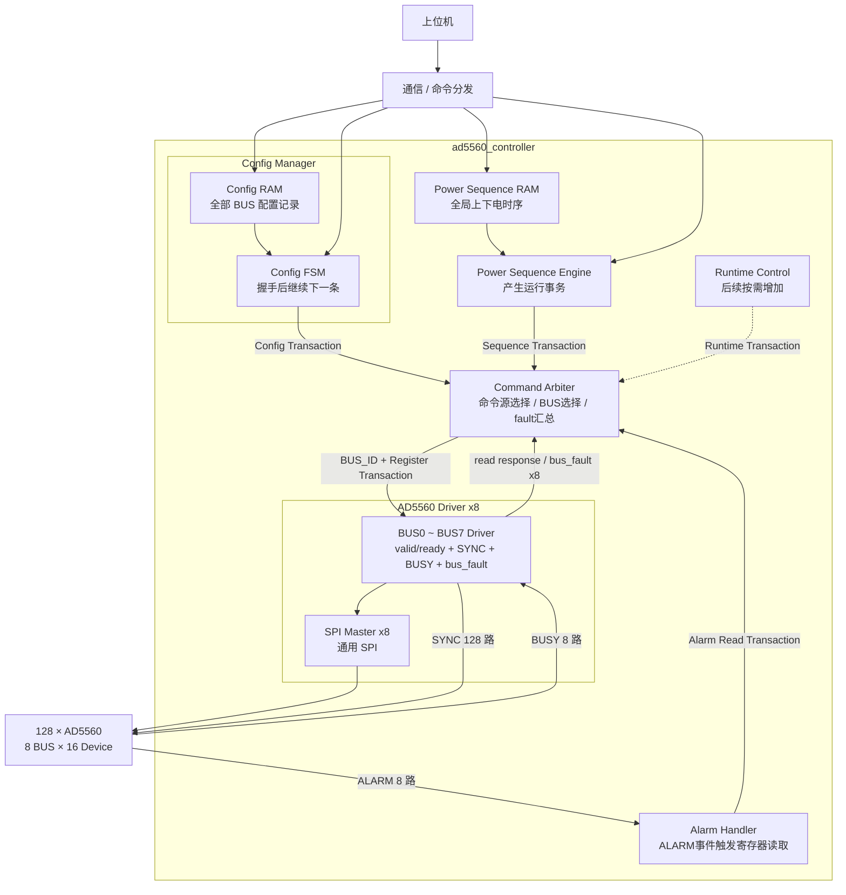

# AD5560 FPGA 系统架构

## 1. 系统

本系统由一片 FPGA 控制 **128 颗 AD5560**。上位机负责下发配置表和运行任务，FPGA 负责配置执行、上下电时序控制、故障处理以及 AD5560 寄存器访问。

### 1.1 SPI 与控制信号

- 共 **8 组 SPI 总线**；
- 每组 SPI 连接 16 颗 AD5560；
- `SYNC` 每颗 AD5560 独立，共 **128 路**；
- 每条 BUS 对应 1 路共享 `BUSY`；
- 每条 BUS 对应 1 路 `ALARM`；
- 每条 BUS 对应一个 `AD5560 Driver` 和一个通用 `SPI Master`。

`AD5560 Driver` 负责本 BUS 的寄存器事务、16 路 `SYNC` 选择、`BUSY` timeout 和本 BUS `bus_fault`。

### 1.2 HW_INH

系统当前只使用 **1 根全局 `HW_INH`**。

正常上下电主要采用 AD5560 的 **Ramp Function + SPI 软件控制**，`HW_INH` 不作为正常单通道上下电时序控制信号。

---

## 2. Config Manager

配置采用寄存器级配置表：

```text
BUS_ID + DEVICE_ID + REG_ADDR + REG_DATA
```

FPGA 不负责把电压、限流、Ramp 等工程参数转换成 AD5560 寄存器值，只负责保存和执行配置表。

### 2.1 Config RAM

第一版将单块全局 `Config RAM` 放在 `Config Manager` 内部，不按 8 条 BUS 分开。

```text
Config Manager
├─ Config RAM
│   ├─ 通信侧写口
│   └─ Manager 内部读口
└─ Config FSM
```

Config Manager 顺序读取记录。当前记录与目标 Driver 完成 `valid / ready` 握手后立即继续下一条，不等待 SPI 事务真正执行完成。

不同 BUS 已接受的配置事务可以并行执行；如果后续记录目标 Driver 尚未 ready，则停在当前记录等待。

Config Manager 只监测 `Command Arbiter` 输出的总 `bus_fault`。任意 BUS 故障后停止剩余配置。

---

## 3. Command Arbiter

所有上层寄存器命令源统一接入 `Command Arbiter`：

```text
Config Manager ───────┐
Power Sequence Engine ├──> Command Arbiter ───> AD5560 Driver × 8
Alarm Handler ────────┤
Runtime Control ──────┘
```

其中 `Runtime Control` 按需要增加。

`Command Arbiter` 负责：

- 选择当前上层命令源；
- 根据 `BUS_ID` 将命令送到目标 Driver；
- 将目标 Driver 的 `ready` 返回给当前命令源；
- 将读事务结果返回给对应上层模块；
- 汇总 8 个 Driver 的 `bus_fault`。

故障输出：

```text
bus_fault             // 任意 BUS 故障
bus_fault_vector[7:0] // 各 BUS 独立故障状态
```

第一版不实现复杂公平仲裁、命令队列或乱序调度。

---

## 4. AD5560 Driver

系统实例化 8 个 `AD5560 Driver`，每个 Driver 对应一条物理 SPI BUS。

Driver 直接通过 `valid / ready` 接收 Arbiter 转发的寄存器事务，并在握手时锁存命令参数。

每个 Driver 负责：

- 根据 `DEVICE_ID` 将 SPI Master 单路 `CS_n` 映射到本组 16 路独立 `SYNC` 中的一路；
- 组织 AD5560 寄存器读写 SPI 帧；
- 封装 readback 两帧流程；
- 调用通用 `SPI Master`；
- 对写事务检测共享 `BUSY` 并处理 timeout；
- `BUSY timeout` 时锁存本 BUS 的 `bus_fault`。

因此：

```text
不同 BUS：8 个 Driver 可并行执行
同一 BUS：单个 Driver 一次只接受一笔事务，自动串行
```

---

## 5. 上下电时序组织

上下电时序采用 **单块全局 `Power Sequence RAM` + 单个 `Power Sequence Engine`**。

128 路上下电时序属于同一个全局时间轴，不按 BUS 分成 8 套独立时序。

`Power Sequence Engine` 顺序读取时序记录并产生：

```text
BUS_ID + Register Transaction
```

事务通过 `Command Arbiter` 发送给目标 Driver。

当前记录完成 `valid / ready` 握手后，Power Sequence Engine 即可继续读取下一条记录，不等待该 Driver 的实际 SPI 事务完成。

系统级故障策略可直接使用 `Command Arbiter` 的 `bus_fault`；需要定位具体 BUS 时使用 `bus_fault_vector[7:0]`。

---

## 6. ALARM 与运行期状态读取

AD5560 不再做后台寄存器轮询，也不设置 Telemetry RAM。

电压、电流实时值由系统外部 ADC 采样，不通过 AD5560 寄存器周期读取。外部 ADC 的具体采样链路不在本文档中展开。

每条 BUS 提供 1 路 `ALARM` 信号，共 8 路。ALARM 由上层 `Alarm Handler` 处理：

```text
ALARM[7:0]
    ↓
Alarm Handler
    ↓
产生寄存器读事务
    ↓
Command Arbiter
    ↓
目标 AD5560 Driver
```

收到某条 BUS 的 ALARM 后，再按需要读取该 BUS 上 AD5560 的 Alarm / Fault Status 寄存器进行故障定位。

因此故障寄存器读取采用**事件触发**方式，不做持续后台轮询。

---

## 7. 多 BUS 选择

Command Arbiter 输出当前命令和 `BUS_ID`，直接选择 8 个 Driver 中的目标实例：

```verilog
assign driver_cmd_valid[n] = cmd_valid && (cmd_bus_id == n);
assign cmd_ready = driver_cmd_ready[cmd_bus_id];
```

Driver 在 `valid && ready` 时锁存本次命令，因此握手后 Arbiter 和上层命令源可以继续处理下一条事务。

---

## 8. 各模块连接关系


