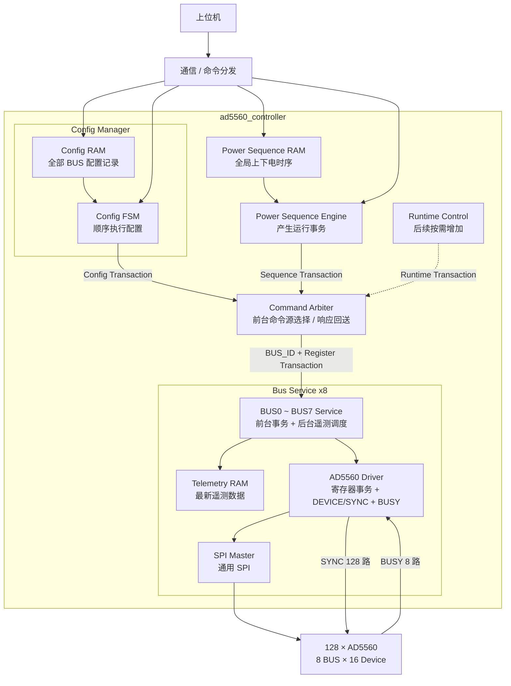

# AD5560 FPGA 系统架构

## 1. 系统

本系统由一片 FPGA 控制 **128 颗 AD5560**。上位机负责下发配置表和运行任务，FPGA 负责配置数据缓存、寄存器配置执行、上下电时序控制以及后台遥测。

### 1.1 SPI 与 SYNC

- 共 **8 组 SPI 总线**；
- 每组 SPI 连接 16 颗 AD5560；
- `SYNC` 每颗 AD5560 独立，共 **128 根 SYNC**；
- 每条 BUS 对应一组共享 `BUSY`；
- 每条 BUS 对应一个 `Bus Service` 和一个 `AD5560 Driver`；
- `AD5560 Driver` 负责本组寄存器事务、16 路 `SYNC` 选择和 1 路共享 `BUSY`。

### 1.2 HW_INH

系统当前只使用 **1 根全局 `HW_INH`**。

正常上下电主要采用 AD5560 的 **Ramp Function + SPI 软件控制**，`HW_INH` 不作为正常单通道上下电时序控制信号。

---

## 2. Config Manager

配置采用**寄存器级配置表**方式。

上位机直接生成并下发 AD5560 配置记录，每条记录包含：

```text
BUS_ID + DEVICE_ID + REG_ADDR + REG_DATA
```

FPGA 不负责把电压、限流、Ramp 等工程参数转换成 AD5560 寄存器值，只负责保存和可靠执行配置表。

### 2.1 Config RAM 组织

第一版将 **单块全局 Config RAM 直接放在 `Config Manager` 内部**，不按 8 条 SPI BUS 分开。

```text
Config Manager
├─ Config RAM
│   ├─ 通信侧写口
│   └─ Manager 内部读口
└─ Config FSM
```

所有 BUS、所有器件的配置记录按上位机生成的顺序连续存储。

`Config Manager` 启动后顺序读取记录，并逐条产生寄存器写事务。第一版完全串行执行：当前配置事务真正完成后，才继续读取下一条记录。

配置时间不是系统瓶颈，因此优先保证 RAM 管理、错误定位和状态机简单。

---

## 3. Command Arbiter

`Config Manager`、`Power Sequence Engine` 以及后续可能增加的运行期寄存器控制模块，统一作为**前台命令源**接入 `Command Arbiter`。

```text
Config Manager ───────┐
Power Sequence Engine ├─> Command Arbiter ─> Bus Service × 8
Runtime Control       ┘     （后续可增加）
```

`Command Arbiter` 负责：

- 选择当前前台命令来源；
- 转发统一寄存器事务及 `BUS_ID`；
- 将目标 `Bus Service` 的 `ready / response` 返回给当前命令源。

第一版不需要复杂公平仲裁。系统正常工作时各类前台任务由工作模式约束，通常不会同时抢占；Arbiter 只需要保证一笔已接受事务的命令源和返回响应保持对应关系。

后台 Telemetry 不经过 `Command Arbiter`，它属于各 `Bus Service` 内部的本地后台任务。

---

## 4. Bus Service

每条 SPI BUS 设置一个 `Bus Service`，负责该 BUS 的本地任务调度。

主要职责：

- 接收 `Command Arbiter` 转发的前台寄存器事务；
- 在总线空闲时执行本 BUS 的后台遥测轮询；
- 调用本 BUS 的 `AD5560 Driver` 完成实际寄存器读写；
- 保存本 BUS 的最新遥测结果。

本 BUS 内的优先级固定为：

```text
前台寄存器事务 > 后台 Telemetry
```

遥测功能按 BUS 独立运行，因此采用 **每 BUS 一块 Telemetry RAM**。

---

## 5. AD5560 Driver

`AD5560 Driver` 是单条 BUS 的 AD5560 寄存器事务执行层，只负责完成一笔指定器件的寄存器读写，不负责配置表管理、上下电时序调度或遥测轮询。

每个 Driver 负责：

- 根据 `DEVICE_ID` 将通用 SPI Master 的 `CS_n` 映射到本组 16 路独立 `SYNC` 中的一路；
- 组织 AD5560 寄存器读写所需 SPI 帧；
- 封装 AD5560 readback 两帧流程；
- 调用通用 `SPI Master`；
- 对写事务检测本组共享 `BUSY` 并处理 timeout。

---

## 6. 上下电时序组织

上下电时序采用 **单块全局 `Power Sequence RAM` + 单个 `Power Sequence Engine`**。

128 路上下电时序属于同一个全局时间轴，不按 BUS 分成 8 套独立时序。

`Power Sequence Engine` 顺序读取时序记录，产生统一的：

```text
BUS_ID + Register Transaction
```

事务先进入 `Command Arbiter`，再送到目标 `Bus Service`。

当前记录完成 `valid / ready` 握手后，`Power Sequence Engine` 即可继续读取下一条记录，不需要等待该 BUS 的实际寄存器事务完成。

因此：

```text
不同 BUS：事务可以重叠执行
同一 BUS：由本 BUS Service / Driver 自动串行执行
```

不同 BUS 的启动时间可能相差少量 FPGA clk，但不要求严格同一时钟周期启动。

---

## 7. 多 BUS 选择

`Command Arbiter` 输出单路前台事务和 `bus_sel / BUS_ID`。

8 个 `Bus Service` 在顶层通过 `generate` 循环例化，每个实例具有固定 `BUS_ID`，目标 BUS 由简单比较选择：

```verilog
localparam [2:0] BUS_ID = bus_index;
wire bus_selected;

assign bus_selected = (bus_sel == BUS_ID);
assign service_cmd_valid[bus_index] = cmd_valid && bus_selected;

assign selected_ready = service_ready[bus_sel];
```

因此 `Command Arbiter` 解决的是**前台命令来源选择**，而目标 BUS 仍通过简单 `BUS_ID` 选择，不需要再增加复杂的多 BUS 调度器。

---

## 8. 各模块连接关系


