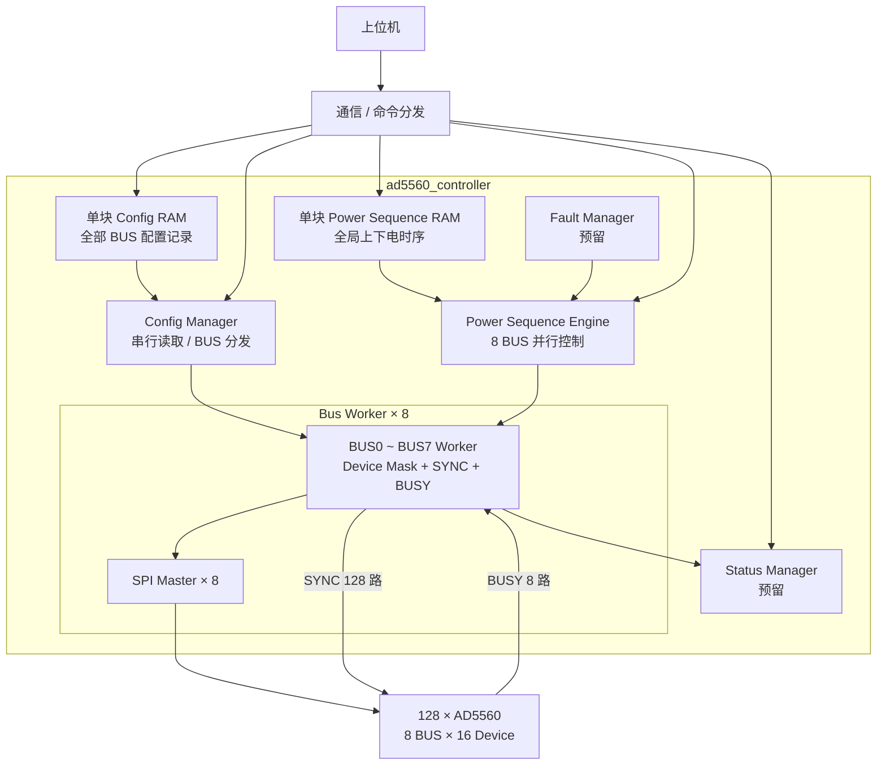

# AD5560 FPGA 系统架构

## 1. 系统定位

本系统由一片 FPGA 控制 **128 颗 AD5560**。上位机负责下发配置表和运行任务，FPGA 负责配置数据缓存、寄存器配置执行以及后续上下电时序控制。

---

## 2. 数字控制信号划分

### 2.1 SPI 与 SYNC

- 共 **8 组 SPI 总线**；
- 每组 SPI 连接 16 颗 AD5560；
- `SYNC` 每颗 AD5560 独立，共 **128 根 SYNC**；
- 每条 BUS 对应一组共享 `BUSY`；
- 每个 `Bus Worker` 负责本组 SPI、16 路 `SYNC` 和 1 路共享 `BUSY`。

### 2.2 HW_INH

系统当前只使用 **1 根全局 `HW_INH`**。

正常上下电主要采用 AD5560 的 **Ramp Function + SPI 软件控制**，`HW_INH` 不作为正常单通道上下电时序控制信号。

---

## 3. FPGA 模块初步划分

当前先按以下模块划分组织 FPGA 内部功能，后续再逐个讨论模块接口和 RTL 细节。

```text
ad5560_controller
│
├── config_ram
│     └─ 单块全局 RAM，保存全部 AD5560 寄存器配置表
│
├── config_manager
│     └─ 顺序读取配置表，并按 BUS_ID 分发给对应 Bus Worker
│
├── bus_worker[0..7]
│     └─ 每个实例负责一组 16 颗 AD5560 的完整寄存器事务
│          ├─ 管理本组 16 路独立 SYNC
│          ├─ 支持 device_mask[15:0] 同时选择多颗器件
│          ├─ 管理本组共享 BUSY，等待器件内部操作完成并处理 timeout
│          └── spi_master
│                └─ 产生对应 SPI BUS 的底层时序
│
├── power_sequence_ram
│     └─ 单块全局 RAM，保存 128 路上下电时序
│
├── power_sequence_engine
│     └─ 按全局时序并行向 8 个 Bus Worker 下发 Ramp 控制任务
│
├── fault_manager
│     └─ 故障处理功能预留，具体策略后续讨论
│
└── status_manager
      └─ 状态汇总与上位机查询功能预留
```

`Config Manager` 和 `Power Sequence Engine` 均通过下层 `Bus Worker` 访问 AD5560，但分别负责“配置阶段”和“运行时序阶段”。

---

## 4. 配置数据组织

配置采用**寄存器级配置表**方式。

上位机直接生成并下发 AD5560 配置记录，每条记录包含：

```text
BUS_ID + DEVICE_ID + REG_ADDR + REG_DATA
```

FPGA 不负责把电压、限流、Ramp 等工程参数转换成 AD5560 寄存器值，只负责保存和可靠执行配置表。

固定配置和通道可变配置使用同一种数据格式。固定寄存器可由上位机保存为默认 Config Table 并下发；后续如需固化到 FPGA，也可增加内部 `Config Loader`，向同一 `Config RAM` 写入配置记录，后级执行模块无需改变。

### 4.1 Config RAM 组织

当前确定采用 **单块全局 `Config RAM`**，不按 8 条 SPI BUS 分成 8 块 RAM。

所有 BUS、所有器件的配置记录按上位机生成的顺序连续存储。`Config Manager` 从头到尾顺序读取配置记录，根据其中的 `BUS_ID` 将当前事务发送给对应的 `Bus Worker`，等待该事务完成后继续读取下一条记录。

当前配置时间不是系统瓶颈，因此第一版配置阶段采用串行执行，优先保证通信、RAM 管理和 `Config Manager` 逻辑简单。

配置阶段的 `DEVICE_ID` 在进入 `Bus Worker` 时转换为 one-hot `device_mask[15:0]`，一次只选择一颗器件。

### 4.2 BUSY 处理

每条 SPI BUS 的 16 颗 AD5560 共用一根 `BUSY`，因此 `BUSY` 作为该 BUS 的组级资源，由对应 `Bus Worker` 直接管理。

第一版采用保守策略：**每完成一笔 SPI transaction，都等待 AD5560 内部处理完成后再返回事务结束**，不使用 BUSY 期间的流水发送优化。

### 4.3 SYNC 处理

`SYNC` 由各 `Bus Worker` 直接管理。

每个 `Bus Worker` 负责本组 16 颗 AD5560 的 16 路独立 `SYNC`，并通过 `device_mask[15:0]` 决定本次 SPI transaction 作用于哪些器件。

因此每个 `Bus Worker` 在物理上完整对应一组 AD5560 资源：

```text
Bus Worker n
├─ SPI BUS n
├─ SYNC[16*n +: 16]
└─ BUSY[n]
```

---

## 5. 上下电时序组织

上下电时序采用 **单块全局 `Power Sequence RAM` + 单个 `Power Sequence Engine`**。

128 路上下电时序属于同一个全局时间轴，不按 BUS 分成 8 套独立时序。

与配置阶段不同，上下电时序必须支持并行执行：

- `Power Sequence Engine` 在同一时刻可以同时向 8 个 `Bus Worker` 下发任务；
- 不同 BUS 的 SPI transaction 可并行执行；
- 同一 BUS 内，如果多颗 AD5560 需要执行完全相同的 Ramp 控制命令，可通过 `device_mask[15:0]` 同时选择多颗器件，使多路 `SYNC` 同时动作；
- 因此同一时刻需要启动的多个通道不需要逐通道串行发送。

典型关系为：

```text
128 bit channel mask
        │
        ├─ [15:0]    -> Bus Worker 0
        ├─ [31:16]   -> Bus Worker 1
        ├─ ...
        └─ [127:112] -> Bus Worker 7
```

例如同一 BUS 内多个器件同时执行 `Enable Ramp` 时，对应 `Bus Worker` 同时拉低这些器件的 `SYNC`，SPI 只发送一次相同命令，从而实现组内同步启动。

`device_mask` 多选仅用于多个器件需要接收**完全相同 SPI 数据**的场景。各通道目标电压、限流、Ramp 参数等个性化数据仍在配置阶段分别写入。

因此系统采用：

```text
配置阶段：串行配置各通道参数

运行阶段：
所有参数已预置
    ↓
Power Sequence Engine 到达目标时刻
    ↓
8 个 Bus Worker 可同时执行
    ↓
同一 BUS 内可通过多个 SYNC 同时触发相同 Ramp 命令
```

---

## 6. 各模块连接关系



当前图只表达已讨论并确认的功能连接关系。具体 Config RAM 记录位宽、Power Sequence RAM 数据格式、Bus Worker 接口及事务仲裁方式后续再确定。
