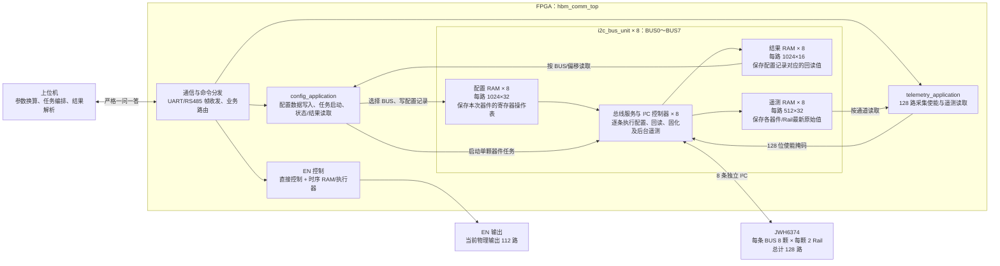

# 多相 Buck FPGA 系统架构

## 1. 系统定位

系统由上位机完成参数计算，FPGA 负责可靠执行：上位机将目标电压、电流、保护阈值等换算成 JWH6374 的 PAGE、寄存器命令和原始数据，FPGA 不做物理量换算，只负责缓存、按序写入/回读、状态采集和 EN 控制。

```text
上位机
  │ RS485/UART：下发配置、启动任务、读取结果/遥测、控制 EN
  ▼
FPGA 通信与业务分发
  ├─ 配置业务 ── 8 组配置/结果 RAM ── 8 路 I²C ── JWH6374
  ├─ 遥测业务 ── 8 组遥测 RAM ────────┘
  └─ EN 控制 ─── 直接控制 / 时序 RAM ── EN 输出
```

通信链路采用严格一问一答，但已启动的 I²C 配置和后台遥测在业务侧继续运行。

## 2. 模块连接关系



图中的 `i2c_bus_unit` 在顶层通过 `generate` 例化 8 次。每个实例独占一条物理 I²C 总线及一套配置、结果、遥测 RAM，因此总线之间可独立工作；单个实例内部则串行服务该 BUS 下的器件。

## 3. 器件与总线划分

- 当前使用 **8 条独立 I²C 总线（BUS0～BUS7）**，第 9 路接口仅预留。
- 每条总线当前管理 **8 颗 JWH6374**，每颗器件有 2 个 Rail，因此每条总线对应 16 路电源，总计 **8 × 8 × 2 = 128 路**。
- 全局通道号映射为：`channel[6:4]=BUS`、`channel[3:1]=DEVICE`、`channel[0]=RAIL`。
- 当前顶层关闭了 TCA9548A 扩展，配置目标器件号限制为 0～7。

## 4. 配置执行流程

1. 上位机计算好寄存器级配置记录，选择 BUS，将记录分包写入该 BUS 的配置 RAM。
2. 上位机发送启动参数：`BUS + DEVICE + 记录数 + 是否固化 + 配置/在线模式`。
3. 对应 BUS 的控制器从 RAM 地址 0 开始逐条执行，只访问本次指定的一颗器件。
4. 每条记录执行后，将读回值写入同一索引的结果 RAM；纯写记录的结果为 0。
5. 上位机查询 BUS 完成状态，再按 BUS、偏移和长度读取结果 RAM。启动命令应答成功只表示任务已接收，不表示配置已经完成。

每条 BUS 各有一套 RAM 和执行控制器。同一 BUS 执行期间不能改写其配置 RAM，也不能再次启动该 BUS；因此同一 BUS 一次只能配置一颗器件。不同 BUS 相互独立，条件允许时可并行执行后台任务。

## 5. RAM 组织

### 配置与结果 RAM

- 配置 RAM：每条 BUS 一块，共 8 块；每块 `1024 × 32 bit`，由该 BUS 下的 8 颗器件共用，并不是为 128 路各保留一份配置。
- 32 位记录格式：`PAGE[31:30] | OP[29:27] | COMMAND[26:19] | DATA[18:3] | RESERVED[2:0]`。
- 结果 RAM：每条 BUS 一块，共 8 块；每块 `1024 × 16 bit`，地址与配置记录索引一一对应。它保存当前/最近任务逐条执行得到的原始回读值，不按 128 路固定分区。

### 遥测 RAM

- 每条 BUS 一块 `512 × 32 bit` 遥测 RAM，用于保存各器件、各 Rail 的最新状态、电压和电流原始值。
- RAM 地址为 `{DEVICE_ID[5:0], RAIL, ITEM[1:0]}`，其中 ITEM 为状态、电压或电流。
- 上位机通过 128 位掩码选择通道；每条 BUS 分得连续 16 位，对应 8 颗器件 × 2 个 Rail。FPGA 返回原始 16 位寄存器值，单位换算仍由上位机完成。

## 6. EN 控制与当前实现状态

- 系统内部按 128 路组织 EN；当前板级只输出低 112 路，高 16 路保留。
- 已有直接 EN 控制和 EN 时序 RAM：时序可保存 128 位目标状态及步间延时。
- 当前顶层实际输出仍选择直接调试 EN，时序控制器虽已实例化但尚未接到最终 EN 输出。
- GROUP 映射、跨板故障联动和统一电源管理属于后续规划，当前 RTL 尚未完整接入；ADC、触发和第 9 路 I²C 等板级接口也仍为预留状态。
